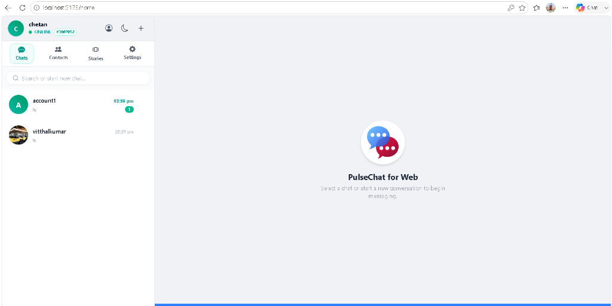
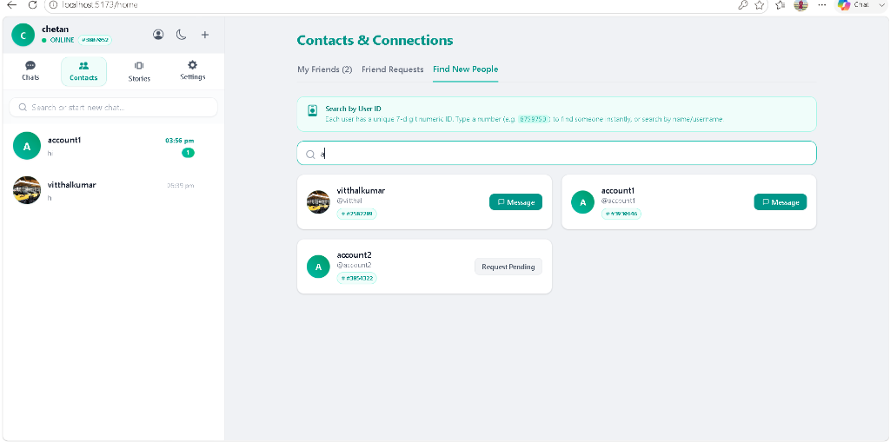
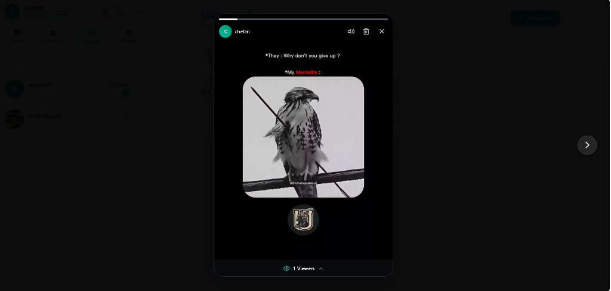
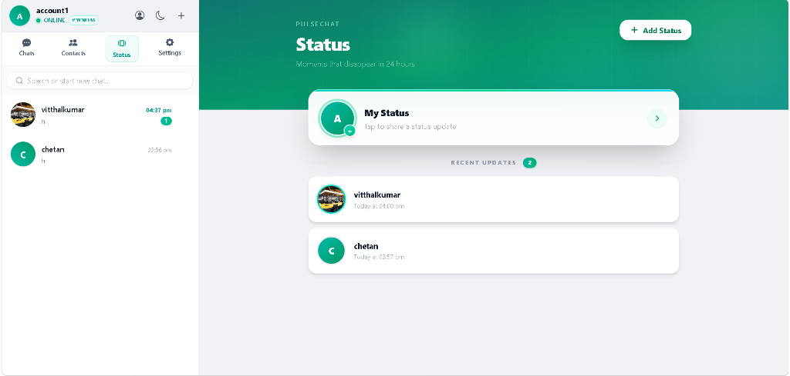

# 💬 PulseChat — Real-Time Chat Application

> A **production-ready**, full-stack real-time chat application built with **Spring Boot** (backend) + **React + Vite** (frontend).

---

## 📋 Table of Contents

- [Overview](#-overview)
- [Screenshots](#-screenshots)
- [Features](#-features)
- [Tech Stack](#-tech-stack)
- [Project Structure](#-project-structure)
- [Architecture](#-architecture)
- [Backend Deep Dive](#-backend-deep-dive)
- [Database Schema](#-database-schema)
- [API Endpoints](#-api-endpoints)
- [Security](#-security)
- [WebSocket & Real-Time Messaging](#-websocket--real-time-messaging)
- [Deployment](#-deployment)
- [Getting Started](#-getting-started)
- [Environment Variables](#-environment-variables)

---

## 🌟 Overview

**PulseChat** is a **full-stack, production-ready** messaging platform that delivers real-time communication between users. It supports **1-on-1 private chats**, **group conversations**, **Stories/Status posts**, media sharing via **Cloudinary**, and live online presence tracking — all secured with **JWT authentication**.

---

## 📸 Screenshots

<details>
<summary>🏠 Home — Chat List</summary>



The main chat list view. All your conversations are listed in the left sidebar, sorted by the latest message. The right panel shows the **PulseChat for Web** landing prompt when no chat is selected. Supports dark/light mode, online presence indicators, and unread message badges.

</details>

---

<details>
<summary>👥 Contacts &amp; Find New People</summary>



The **Contacts & Connections** page with three tabs — *My Friends*, *Friend Requests*, and *Find New People*. Users can search contacts by their unique **7-digit User ID** or by name/username. Each result shows the user's avatar, username, and unique ID. You can instantly **Message** existing friends or send a friend request (shown as "Request Pending").

</details>

---

<details>
<summary>📖 Stories Viewer</summary>



The **Status Stories** viewer overlay. Stories play full-screen with the owner's avatar and name at the top. Supports navigation between multiple stories, a **viewer count** at the bottom, mute/delete controls, and auto-advancing slides.

</details>

---

<details>
<summary>📡 Status / Stories Page</summary>



The **Status & Stories** hub — inspired by WhatsApp-style stories. The top card shows **My Status** with a quick tap-to-share prompt. Below it, the **Recent Updates** section lists all friends who have posted a status in the last 24 hours, showing their avatar, name, and the time of their latest update. Clicking any entry opens the full-screen **Stories Viewer** overlay. The teal gradient header and **+ Add Status** button make it easy to post a new story (text, image, or video).

</details>

---

## ✨ Features

### 💬 Messaging
- Real-time messaging over **WebSocket (STOMP + SockJS)**
- Send text, images, videos, audio, and file attachments
- **Reply** to specific messages (threaded replies)
- **Forward** messages to other chats
- **Edit** and **Delete** messages (for me / for everyone)
- **Emoji reactions** on messages
- **Star/Bookmark** messages for quick access
- **Search** message history within a chat
- **Paginated** message loading (infinite scroll, 30 messages/page)
- **Read receipts** (single tick → double tick → blue tick)

### 👥 Friends & Contacts
- Send, accept, and reject **friend requests**
- View friends / contacts list
- Search users by **username** or **unique number** (like a phone number)
- Block/unblock users

### 🗂️ Chats & Groups
- Create and manage **group chats**
- Add/remove group members
- **Admin badge** displayed next to group admins in the members list
- **Delete group** — permanently remove a group (group admin only)
- Promote/demote members to/from admin role
- One-on-one private chats automatically created on friend acceptance

### 📸 Stories / Status
- Post **text**, **image**, or **video** stories
- Stories **auto-expire after 24 hours**
- View who has seen your story
- **React** to stories with emoji
- **Privacy controls**: My Contacts, Everyone, or custom exclude/include lists

### 👤 User Profile
- Profile picture upload (via Cloudinary)
- Bio, full name, username, unique number
- **Privacy settings**: control who sees last seen, profile photo, and who can add you to groups
- Online/offline status with **last seen** timestamp

### 🔔 Notifications
- In-app notifications for messages, friend requests, and group events
- Mark notifications as read

### 🔐 Authentication
- Register with email + password
- Login with JWT token
- Logout updates user status to offline

---

## 🛠️ Tech Stack

### Backend
| Technology | Purpose |
|---|---|
| **Java 17** | Core language |
| **Spring Boot 3.3.4** | Application framework |
| **Spring Security** | JWT-based stateless authentication |
| **Spring Data JPA + Hibernate** | ORM & database access |
| **Spring WebSocket (STOMP)** | Real-time messaging |
| **MySQL 8** | Primary relational database |
| **Cloudinary** | Cloud media storage (images, videos, files) |
| **SpringDoc OpenAPI (Swagger)** | API documentation |
| **ModelMapper** | DTO ↔ Entity mapping |
| **Lombok** | Boilerplate code reduction |
| **JJWT 0.12.6** | JSON Web Token generation & validation |
| **BCrypt (strength 12)** | Password hashing |

### Frontend
| Technology | Purpose |
|---|---|
| **React 19** | UI library |
| **Vite 8** | Fast development build tool |
| **React Router DOM 7** | Client-side routing |
| **Tailwind CSS 4** | Utility-first styling |
| **Axios** | HTTP client for REST API calls |
| **SockJS + STOMP.js** | WebSocket client for real-time chat |
| **Lucide React + React Icons** | Icon libraries |
| **Emoji Picker React** | In-chat emoji picker |

### Build Tool
| Technology | Purpose |
|---|---|
| **Maven** | Backend build & dependency management |

---

## 📁 Project Structure

```
chatapp/
├── pom.xml                            # Maven dependencies & build config
│
├── src/main/java/com/vitthal/chatapp/
│   ├── ChatappApplication.java        # Entry point (@EnableAsync, @EnableScheduling)
│   │
│   ├── config/                        # Spring configuration beans
│   │   ├── SecurityConfig.java        # JWT security filter chain, CORS, stateless sessions
│   │   ├── WebSocketConfig.java       # STOMP broker, /ws endpoint, SockJS fallback
│   │   ├── CloudinaryConfig.java      # Cloudinary SDK initialization
│   │   ├── CorsConfig.java            # Cross-origin resource sharing rules
│   │   ├── ModelMapperConfig.java     # ModelMapper bean
│   │   ├── OpenApiConfig.java         # Swagger/OpenAPI configuration
│   │   └── WebConfig.java             # Static resource & MVC config
│   │
│   ├── controller/                    # REST API controllers (8 controllers)
│   │   ├── AuthController.java        # /api/auth — register, login, logout
│   │   ├── ChatController.java        # /api/chats — create, list, manage chats
│   │   ├── FriendController.java      # /api/friends — friend requests & friendships
│   │   ├── GroupController.java       # /api/groups — group management
│   │   ├── MessageController.java     # /api/messages — send, edit, delete, react, star
│   │   ├── NotificationController.java# /api/notifications — in-app notifications
│   │   ├── StatusController.java      # /api/status — Stories/Status posts
│   │   └── UserController.java        # /api/users — profile, search, settings
│   │
│   ├── entity/                        # JPA entities (15 tables)
│   │   ├── User.java                  # User account with privacy settings
│   │   ├── Chat.java                  # Chat room (1-on-1 or group)
│   │   ├── ChatMember.java            # Chat-User join table
│   │   ├── Message.java               # Message with reply/forward support
│   │   ├── MessageStatusEntity.java   # Per-user read/delivery status
│   │   ├── Attachment.java            # Media files attached to messages
│   │   ├── StarredMessage.java        # User bookmarked messages
│   │   ├── FriendRequest.java         # Pending friend requests
│   │   ├── Friendship.java            # Accepted friend relationships
│   │   ├── Notification.java          # In-app notifications
│   │   ├── Status.java                # Story/status post (24h expiry)
│   │   ├── StatusMedia.java           # Media items within a story
│   │   ├── StatusView.java            # Who viewed a story
│   │   ├── StatusReaction.java        # Emoji reactions on stories
│   │   └── StatusPrivacyConfig.java   # Per-story privacy rules
│   │
│   ├── service/                       # Business logic interfaces + implementations
│   │   ├── impl/                      # Service implementation classes
│   │   ├── AuthService.java           # Registration, login, logout
│   │   ├── ChatService.java           # Chat creation & management
│   │   ├── CloudinaryService.java     # Upload/delete media via Cloudinary
│   │   ├── FriendService.java         # Friend requests & friendships
│   │   ├── GroupService.java          # Group operations
│   │   ├── MessageService.java        # Messaging CRUD + reactions
│   │   ├── NotificationService.java   # Notification creation & delivery
│   │   ├── StatusService.java         # Story creation & expiry
│   │   └── UserService.java           # Profile & settings management
│   │
│   ├── security/                      # JWT auth infrastructure
│   │   ├── JwtTokenProvider.java      # Token generation, validation, extraction
│   │   ├── JwtAuthenticationFilter.java # Servlet filter reads Bearer token per request
│   │   ├── JwtAuthenticationEntryPoint.java # Returns 401 for unauthorized access
│   │   └── CustomUserDetailsService.java    # Loads user from DB for Spring Security
│   │
│   ├── websocket/                     # WebSocket controllers
│   │   ├── ChatWebSocketController.java      # Handles real-time message events
│   │   ├── OnlineStatusWebSocketController.java # Tracks user online/offline
│   │   └── WebSocketEventListener.java       # STOMP connect/disconnect hooks
│   │
│   ├── dto/                           # Data Transfer Objects (request & response)
│   ├── repository/                    # Spring Data JPA repositories
│   ├── mapper/                        # Entity to DTO conversion logic
│   ├── exception/                     # Custom exceptions & global error handler
│   └── constants/                     # Enums: UserRole, StatusType, StatusPrivacyType
│
├── src/main/resources/
│   └── application.properties         # DB, JWT, Cloudinary, CORS, logging config
│
└── frontend/                          # React + Vite frontend
    ├── index.html                     # HTML entry point
    ├── vite.config.js                 # Vite + Tailwind plugin config
    ├── package.json                   # Node dependencies
    └── src/
        ├── main.jsx                   # React app bootstrap
        ├── App.jsx                    # Root component with routing
        ├── api/                       # Axios API service modules
        ├── context/                   # React Context (auth, socket state)
        ├── components/                # Reusable UI components
        │   ├── ChatWindow.jsx         # Full chat UI (messages, input, toolbar)
        │   ├── MessageBubble.jsx      # Individual message renderer
        │   ├── Sidebar.jsx            # Chat list + search
        │   ├── StoryViewer.jsx        # Full-screen story/status viewer
        │   ├── StoryRing.jsx          # Story ring avatar component
        │   ├── CreateGroupModal.jsx   # Group creation modal
        │   ├── NotificationModal.jsx  # In-app notifications popup
        │   └── ConfirmModal.jsx       # Generic confirmation dialog
        └── pages/                     # Route-level page components
            ├── Home.jsx               # Main chat dashboard
            ├── Login.jsx              # Login page
            ├── Register.jsx           # Registration page
            ├── ContactsPage.jsx       # Friends & contacts management
            ├── StoriesPage.jsx        # Browse & post stories
            ├── ProfilePage.jsx        # View/edit user profile
            ├── SettingsPage.jsx       # App preferences & privacy
            └── SplashScreen.jsx       # Initial loading screen
```

---

## 🏗️ Architecture

```
+--------------------------------------------------+
|                  FRONTEND (React)                |
|  Browser <-> REST API (Axios)                    |
|  Browser <-> WebSocket (SockJS + STOMP)          |
+------------------+-------------------------------+
                   | HTTP / WS
+------------------v-------------------------------+
|               BACKEND (Spring Boot)              |
|                                                  |
|  +----------+  +--------------+  +-----------+   |
|  |   REST   |  |  WebSocket   |  |  Security |   |
|  |Controllers|  |  Controllers |  |  (JWT)    |   |
|  +-----+----+  +------+-------+  +-----------+   |
|        |               |                         |
|  +-----v---------------v-------+                 |
|  |      Service Layer          |                 |
|  +-----+-----------------------+                 |
|        |                                         |
|  +-----v-----------+  +---------------------+    |
|  | JPA/Hibernate   |  |  External Services  |    |
|  | Repositories    |  |  - Cloudinary       |    |
|  +-----+-----------+  +---------------------+    |
+--------+-----------------------------------------+
         |
+--------v---------+
|    MySQL 8        |
|   (15 tables)     |
+-------------------+
```

---

## 🔧 Backend Deep Dive

### Entry Point
`ChatappApplication.java` bootstraps the Spring Boot application with:
- `@EnableAsync` — async method execution for non-blocking operations
- `@EnableScheduling` — scheduled tasks (e.g., expired story cleanup)

### Security Layer
JWT-based, fully stateless authentication:
1. **Registration/Login** returns a signed JWT token
2. Every request includes `Authorization: Bearer <token>` header
3. `JwtAuthenticationFilter` intercepts each request, validates the token, and sets the Spring Security context
4. `SecurityConfig` defines public endpoints (`/api/auth/**`, `/ws/**`, `/swagger-ui/**`) — everything else requires authentication
5. Passwords hashed with **BCrypt (strength 12)**
6. Sessions are **STATELESS** — no cookies, no server-side session

### WebSocket Layer
Real-time messaging via **STOMP over SockJS**:
- Client connects to `/ws` endpoint with SockJS fallback
- Messages to server are prefixed with `/app`
- Broadcast topics use `/topic` (group messages)
- Private messages use `/queue` (point-to-point)
- User-specific destinations use `/user` prefix
- `WebSocketEventListener` tracks connect/disconnect to update online status in real time

### Cloudinary Integration
`CloudinaryService` handles:
- Upload images, videos, and files for messages
- Upload profile pictures
- Upload story/status media
- Delete media when messages/stories are removed

---

## 🗄️ Database Schema

The application manages **15 JPA entities** mapped to MySQL tables:

| Table | Description |
|---|---|
| `users` | User accounts (auth, profile, privacy, online status) |
| `chats` | Chat rooms (1-on-1 or group) |
| `chat_members` | Users to Chats many-to-many with role |
| `messages` | All chat messages with reply/forward references |
| `message_status` | Per-user delivery & read receipts (blue ticks) |
| `attachments` | Media files linked to messages (stored on Cloudinary) |
| `starred_messages` | Bookmarked messages per user |
| `friend_requests` | Pending friend connection requests |
| `friendships` | Accepted friendships between users |
| `notifications` | In-app notification records |
| `status` | Story/status posts (expires after 24h) |
| `status_media` | Image/video items within a story |
| `status_views` | View log for stories |
| `status_reactions` | Emoji reactions on stories |
| `status_privacy_config` | Per-story privacy rules (include/exclude lists) |

---

## 📡 API Endpoints

All REST endpoints are documented via **Swagger UI** at:
```
http://localhost:8080/swagger-ui/index.html
```

### Auth — `/api/auth`
| Method | Endpoint | Description |
|---|---|---|
| POST | `/register` | Register new user |
| POST | `/login` | Login, returns JWT |
| POST | `/logout` | Logout, sets user offline |

### Messages — `/api/messages`
| Method | Endpoint | Description |
|---|---|---|
| POST | `/send` | Send message with optional media |
| PUT | `/edit` | Edit message text |
| DELETE | `/{id}/me` | Delete for me only |
| DELETE | `/{id}/everyone` | Delete for everyone |
| GET | `/chat/{chatId}` | Paginated chat messages |
| GET | `/chat/{chatId}/search` | Search messages in a chat |
| POST | `/{id}/star` | Toggle star/bookmark |
| GET | `/starred` | Get all starred messages |
| POST | `/{id}/forward/{chatId}` | Forward message to another chat |
| POST | `/{id}/react` | Add/toggle emoji reaction |
| POST | `/chat/{chatId}/read` | Mark all messages as read |

### Chats — `/api/chats`
| Method | Endpoint | Description |
|---|---|---|
| GET | `/` | List all chats for current user |
| POST | `/` | Create a new chat |
| GET | `/{id}` | Get single chat details |

### Friends — `/api/friends`
| Method | Endpoint | Description |
|---|---|---|
| POST | `/request` | Send friend request |
| POST | `/accept/{id}` | Accept friend request |
| POST | `/reject/{id}` | Reject friend request |
| GET | `/` | List all friends |
| GET | `/requests` | List pending requests |

### Groups — `/api/groups`
| Method | Endpoint | Description |
|---|---|---|
| POST | `/create` | Create a new group chat with optional avatar |
| POST | `/{id}/add-members` | Add members to group (admin only) |
| DELETE | `/{id}/remove-member/{userId}` | Remove a member from group (admin only) |
| POST | `/{id}/leave` | Leave a group chat |
| PUT | `/{id}/promote/{targetUserId}` | Promote a member to admin (admin only) |
| PUT | `/{id}/demote/{targetUserId}` | Demote an admin to normal member (admin only) |
| PUT | `/{id}/info` | Update group name, description, or picture (admin only) |
| DELETE | `/{id}` | **Delete group permanently (admin only)** |

### Status/Stories — `/api/status`
| Method | Endpoint | Description |
|---|---|---|
| POST | `/` | Create a story (text/image/video) |
| GET | `/` | Get all visible stories (friends) |
| GET | `/mine` | Get own stories |
| POST | `/{id}/view` | Record a story view |
| POST | `/{id}/react` | React to a story |
| DELETE | `/{id}` | Delete a story |

### Users — `/api/users`
| Method | Endpoint | Description |
|---|---|---|
| GET | `/me` | Get own profile |
| PUT | `/me` | Update profile |
| PUT | `/me/picture` | Upload profile photo |
| GET | `/search` | Search users by username |
| GET | `/{id}` | View another user profile |

### Notifications — `/api/notifications`
| Method | Endpoint | Description |
|---|---|---|
| GET | `/` | List all notifications |
| POST | `/{id}/read` | Mark notification as read |
| POST | `/read-all` | Mark all as read |

---

## 🔐 Security

- **JWT (JJWT 0.12.6)** — stateless Bearer token authentication
- **BCrypt (strength 12)** — industry-standard password hashing
- **Stateless sessions** — no server-side session storage, fully scalable
- **Method-level security** — `@PreAuthorize` / `@PostAuthorize` annotations
- **CORS** — configured per-origin via `CorsConfig`
- **Public routes only**: `/api/auth/**`, `/ws/**`, `/swagger-ui/**`

---

## 🔌 WebSocket & Real-Time Messaging

The app uses **STOMP** (Simple Text Oriented Messaging Protocol) over **SockJS** for real-time communication.

### Connection Flow
```
1. Client connects to:  ws://localhost:8080/ws
2. SockJS fallback if native WS is unsupported
3. STOMP CONNECT with JWT in headers
4. Server authenticates & confirms
5. Client subscribes to relevant channels
```

### Channel Topics
| Channel | Direction | Purpose |
|---|---|---|
| `/app/chat.send` | Client to Server | Send a message |
| `/app/online.status` | Client to Server | Update online status |
| `/topic/chat/{chatId}` | Server to Client | Receive messages in a chat |
| `/queue/notifications` | Server to Client | Personal notifications |
| `/user/queue/messages` | Server to Client | Direct user messages |

---

## 🚢 Deployment

### Backend
```bash
# Build the JAR
./mvnw clean package -DskipTests

# Run
java -jar target/chatapp-0.0.1-SNAPSHOT.jar
```

### Frontend
```bash
cd frontend

# Install dependencies
npm install

# Development server (hot reload)
npm run dev

# Production build
npm run build
```

---

## 🚀 Getting Started

### Prerequisites
- **Java 17+**
- **Node.js 18+** and npm
- **MySQL 8.0**
- **Cloudinary account** (free tier works)

### 1. Clone the repository
```bash
git clone https://github.com/vitthal-v-k/PulseChat.git
cd PulseChat
```

### 2. Configure environment
Create `src/main/resources/application.properties` or export environment variables (see below).

### 3. Start the app
```bash
# Terminal 1 — Backend
./mvnw spring-boot:run

# Terminal 2 — Frontend
cd frontend && npm install && npm run dev
```

### 4. Access the app
| Service | URL |
|---|---|
| Frontend | http://localhost:5173 |
| Backend API | http://localhost:8080 |
| Swagger UI | http://localhost:8080/swagger-ui/index.html |

---

## ⚙️ Environment Variables

| Variable | Description | Example |
|---|---|---|
| `SPRING_DATASOURCE_URL` | MySQL JDBC URL | `jdbc:mysql://localhost:3306/chatapp_db` |
| `SPRING_DATASOURCE_USERNAME` | MySQL username | `root` |
| `SPRING_DATASOURCE_PASSWORD` | MySQL password | `root` |
| `APP_JWT_SECRET` | JWT signing secret (min 32 chars) | `your-super-secret-key-here` |
| `APP_JWT_EXPIRY` | JWT expiry in ms | `86400000` (24h) |
| `CLOUDINARY_CLOUD_NAME` | Cloudinary cloud name | `your-cloud-name` |
| `CLOUDINARY_API_KEY` | Cloudinary API key | `123456789012345` |
| `CLOUDINARY_API_SECRET` | Cloudinary API secret | `your-api-secret` |
| `APP_CORS_ALLOWED_ORIGINS` | Allowed frontend origins | `http://localhost:5173` |

---

## 👨‍💻 Author

Built by **Vitthal** — **PulseChat** is a production-ready full-stack real-time chat application demonstrating modern Java (Spring Boot) and React development.

---

## 📄 License

This project is licensed under the **MIT License**.

```
MIT License

Copyright (c) 2026 Vitthal

Permission is hereby granted, free of charge, to any person obtaining a copy
of this software and associated documentation files (the "Software"), to deal
in the Software without restriction, including without limitation the rights
to use, copy, modify, merge, publish, distribute, sublicense, and/or sell
copies of the Software, and to permit persons to whom the Software is
furnished to do so, subject to the following conditions:

The above copyright notice and this permission notice shall be included in all
copies or substantial portions of the Software.

THE SOFTWARE IS PROVIDED "AS IS", WITHOUT WARRANTY OF ANY KIND, EXPRESS OR
IMPLIED, INCLUDING BUT NOT LIMITED TO THE WARRANTIES OF MERCHANTABILITY,
FITNESS FOR A PARTICULAR PURPOSE AND NONINFRINGEMENT. IN NO EVENT SHALL THE
AUTHORS OR COPYRIGHT HOLDERS BE LIABLE FOR ANY CLAIM, DAMAGES OR OTHER
LIABILITY, WHETHER IN AN ACTION OF CONTRACT, TORT OR OTHERWISE, ARISING FROM,
OUT OF OR IN CONNECTION WITH THE SOFTWARE OR THE USE OR OTHER DEALINGS IN THE
SOFTWARE.
```
